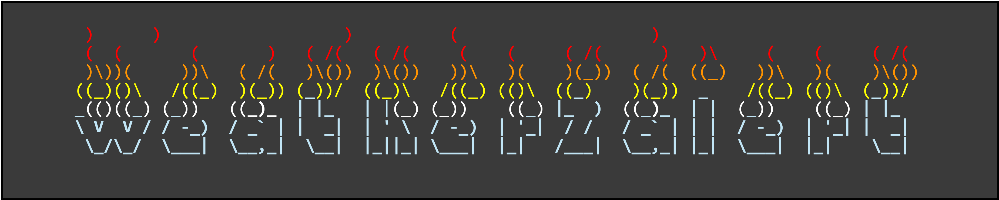

<h1>
  <a href="#"></a>
</h1>

## Welcome to the weather2alert package

This package provides a Gymnasium environment (formerly OpenAI Gym) for training reinforcement learning agents to control and optimize when to send alerts based on the observed heat index during summer and alerting history to minimize the number of hospitalizations due to heat-related illnesses.

The environment was calibrated from a comprehensive data set between 2006--2016 of heat index values, hospitalizations, and alerts from various sources, including the National Weather Service, the Centers for Disease Control and Prevention, the Census Bureau, Centers for Medicare and Medicaid Services, and the National Oceanic and Atmospheric Administration.

The mathematical model and a detailed description of the data sources and modeling approach is available in the following publication:


```bibtex
@article{considine2023optimizing,
  title={Optimizing Heat Alert Issuance with Reinforcement Learning},
  author={Considine, Ellen M and Nethery, Rachel C and Wellenius, Gregory A and Dominici, Francesca and Tec, Mauricio},
  journal={arXiv preprint arXiv:2312.14196},
  year={2023}
}
```

### Getting Started

The package is still under development and is not yet available on PyPI. To install the package, run the following command:

```bash
pip install git+https://github.com/NSAPH-Projects/weather2alert
```

To create an environment, use the following code:

```python
import weather2alert
env = weather2alert.env.HeatAlertEnv(seed=1234)
obs, info = env.reset(location='06037', similar_climate_counties=False)
```

The `location` parameter is a string that represents the FIPS code of the county where the environment is located. The default value is `'06037'`, which corresponds to Los Angeles County, California. When the `location` is not provided, it will be chosen randomly from the available locations. The keyword argument `similar_climate_counties` is a boolean that determines whether the environment will use climate data from similar counties to the reference to augment the available episodes. The default value is `False`. See the paper for details on the data augmentation process for climate transitions.

Use the environment with the standard Gymnasium API. For example:

```python

done = False
while not done:
    action = env.action_space.sample()
    obs, reward, done, info = env.step(action)
```

The available actions are always `0` (do not send an alert) and `1` (send an alert). 

The simulations contain real climate data from 2006 to 2016, and the environment is designed to be episodic. The episode ends when the simulation reaches the end of the data set. A year is chosen randomly from the data set every time the environment is reset.

The rewards represent the (scaled) negative rate of hospitalizations due to heat-related illnesses. The goal is to minimize the number of hospitalizations by sending alerts when the heat index is above a certain threshold.

## Running DDTS Baselines

This package includes several Decision-Theoretic Time Series (DDTS) baseline policies that can serve as benchmarks for evaluating reinforcement learning agents. These baselines originated from decision-theoretic approaches to sequential decision making under uncertainty and provide simple heuristic policies for comparison.

### Available DDTS Baselines

The following baseline policies are available:

- **Threshold**: Issues alerts when heat index exceeds a fixed threshold (default: 0.75)
- **Conservative**: Issues alerts only for very high heat index values (threshold: 0.9)
- **Aggressive**: Issues alerts for moderate heat index values (threshold: 0.5)
- **Budget Aware**: Adjusts threshold based on season progress to conserve budget
- **Random**: Issues alerts randomly with a fixed probability

### Running DDTS Baselines

Use the `gym_runner.py` script to run DDTS baselines:

```bash
# Run threshold baseline on heat alert environment
python gym_runner.py --env heat --baseline threshold --episodes 10

# Run conservative baseline with verbose output
python gym_runner.py --env heat --baseline conservative --episodes 5 --verbose

# Run budget-aware baseline with different seed
python gym_runner.py --env heat --baseline budget_aware --episodes 10 --seed 123
```

### Baseline Options

- `--env`: Environment to run (heat, uganda, mimic, binpacking)
- `--baseline`: Baseline policy (threshold, conservative, aggressive, budget_aware, random)
- `--episodes`: Number of episodes to run (default: 10)
- `--seed`: Random seed for reproducibility (default: 42)
- `--verbose`: Enable detailed output
- `--render`: Render environment during execution

### Example Output

```
Running DDTS baseline 'threshold' on environment 'heat'
Episodes: 10, Seed: 42
--------------------------------------------------

Results for threshold baseline:
Mean reward: -7165.73 ± 361.08
Mean episode length: 153.0
Mean alerts per episode: 19.7
```

### Numeric Environment Support

The `gym_runner.py` script is designed to import and run numeric environments from the user's codebase, including:

- **Heat Alerts**: Weather-based alert optimization (prioritized implementation)
- **Uganda**: Placeholder for Uganda-specific environment
- **Mimic**: Placeholder for medical decision-making environment  
- **Bin Packing**: Placeholder for resource allocation environment

To add support for additional numeric environments, modify the `create_environment()` function in `gym_runner.py` to import your custom Gymnasium environments.

### Origin of DDTS Baselines

The DDTS (Decision-Theoretic Time Series) baselines implemented here are derived from classical decision theory principles applied to sequential decision making problems. They provide simple, interpretable policies that:

1. Use domain knowledge (e.g., heat index thresholds for heat alerts)
2. Consider resource constraints (e.g., alert budgets)
3. Account for temporal dependencies (e.g., alert fatigue, seasonal patterns)
4. Provide deterministic or simple stochastic policies for reproducible benchmarking

These baselines serve as important benchmarks for evaluating the performance of more sophisticated reinforcement learning agents, helping to establish whether the complexity of RL methods provides meaningful improvements over simpler heuristic approaches.
