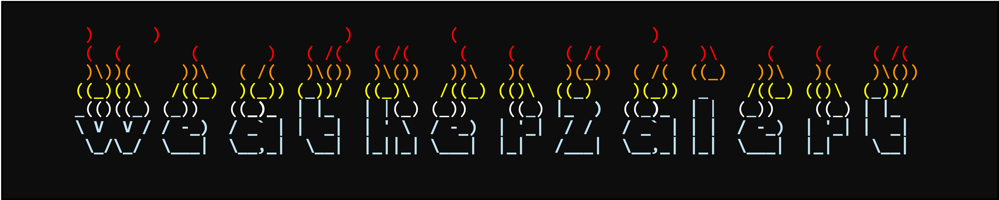

<h1>
  <a href="#"></a>
</h1>

## Welcome to the weather2alert package

This package provides a Gymnasium environment (formerly OpenAI Gym) for training reinforcement learning agents to control and optimize when to send alerts based on the observed heat index during summer and alerting history to minimize the number of hospitalizations due to heat-related illnesses.

The environment was calibrated from a comprehensive data set between 2006--2016 of heat index values, hospitalizations, and alerts from various sources, including the National Weather Service, the Centers for Disease Control and Prevention, the Census Bureau, Centers for Medicare and Medicaid Services, and the National Oceanic and Atmospheric Administration.

The mathematical model and a detailed description of the data sources and modeling approach is available in the following publication:


```bibtex
@article{considine2023optimizing,
  title={Optimizing Heat Alert Issuance for Public Health in the United States with Reinforcement Learning},
  author={Considine, Ellen M and Nethery, Rachel C and Wellenius, Gregory A and Dominici, Francesca and Tec, Mauricio},
  journal={arXiv preprint arXiv:2312.14196},
  year={2023}
}
```


### Getting Started

The package is still under development and is not yet available on PyPI. To install the package, run the following command:

```bash
pip install git+https://github.com/NSAPH-Projects/weather2alert@dev
```

To create an environment, use the following code:

```python
import weather2alert
env = weather2alert.make(location='06037')
```

The `location` parameter is a string that represents the FIPS code of the county where the environment is located. The default value is `'06037'`, which corresponds to Los Angeles County, California. When the `location` is not provided, it will be chosen randomly from the available locations.

However, keep in mind that the data-generating mechanism is different for each location.

To use the environment, train as usual in Gymnasium environment. For example:

```python
import gymnasium as gym

obs, info = env.reset()
done = False
while not done:
    action = env.action_space.sample()
    obs, reward, done, info = env.step(action)
```

The available actions are always `0` (do not send an alert) and `1` (send an alert). 

The simulations contain real climate data from 2006 to 2016, and the environment is designed to be episodic. The episode ends when the simulation reaches the end of the data set. A year is chosen randomly from the data set every time the environment is reset.

The rewards represent the (scaled) negative rate of hospitalizations due to heat-related illnesses. The goal is to minimize the number of hospitalizations by sending alerts when the heat index is above a certain threshold.